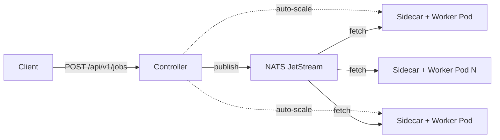

# KQueue

A scalable job queue processing framework for Kubernetes. Submit work via REST API, process it with auto-scaling worker pods, and monitor everything through a built-in dashboard.



## Features

- **Persistent job queue** -- NATS JetStream with file-backed storage, survives restarts
- **Auto-scaling workers** -- three strategies (threshold, rate, target-per-worker) with cost-aware scaling for expensive pods
- **Dead letter queue** -- failed jobs are captured after configurable retries, retryable via API
- **Schema validation** -- per-queue JSON Schema rejects bad payloads at submit time (HTTP 422)
- **Any language workers** -- workers are simple HTTP servers (`POST /process`); write them in Go, Python, Rust, anything
- **Sidecar pattern** -- workers know nothing about NATS, retries, or Kubernetes
- **gVisor sandboxing** -- run untrusted workloads with syscall isolation via Kubernetes RuntimeClass
- **Web dashboard** -- real-time queue stats, job browser, log viewer, DLQ management
- **Prometheus metrics** -- jobs submitted/completed/failed, queue depth, worker count, processing duration
- **Cost-aware scaling** -- configurable startup cost, scale-down delay, idle worker pools, and gradual scale-down rates

## Quick Start

```bash
# Build and start everything locally
make docker-build
make docker-up

# Open the dashboard
open http://localhost:8080

# Submit a job
curl -X POST http://localhost:8080/api/v1/jobs \
  -H "Content-Type: application/json" \
  -d '{"queue":"echo","payload":{"action":"uppercase","text":"hello world"}}'

# Check queue stats
make status

# Submit 20 jobs to test scaling
make submit-batch
```

## Example Queues

| Queue | Worker | Language | Description |
|-------|--------|----------|-------------|
| `echo` | [examples/echo-worker](examples/echo-worker/) | Go | Multi-action worker: echo, uppercase, count, sort, reverse, hash, delay. Accepts any JSON payload. |
| `nlp` | [examples/nlp-worker](examples/nlp-worker/) | Python | NLP analysis: word count, sentence count, word frequency, text reversal. Requires `{"text":"..."}`. |
| `sandbox` | [examples/sandbox-worker](examples/sandbox-worker/) | Go | Executes shell commands from payloads. Designed for gVisor sandboxing in Kubernetes. |

## API

| Method | Endpoint | Description |
|--------|----------|-------------|
| `POST` | `/api/v1/jobs` | Submit a job |
| `GET` | `/api/v1/jobs/{id}` | Get job status and result |
| `GET` | `/api/v1/jobs/{id}/logs` | Get per-job processing logs |
| `GET` | `/api/v1/queues` | List all queue stats |
| `GET` | `/api/v1/queues/{name}/jobs?status=` | Browse jobs for a queue |
| `GET` | `/api/v1/queues/{name}/schema` | Get payload schema |
| `GET` | `/api/v1/queues/{name}/dlq` | List dead letter jobs |
| `POST` | `/api/v1/queues/{name}/dlq/{id}/retry` | Retry a DLQ job |

## Creating a Worker

Workers implement two HTTP endpoints on port 8080:

```
GET  /health   -> 200 {"status":"ok"}
POST /process  -> receives {"job_id":"...","payload":<any JSON>}
                  returns  {"success":true,"result":{...}}
                  or       {"success":false,"error":"reason"}
```

The sidecar handles NATS, retries, dead-letter routing, metrics, and log forwarding. Your worker just processes the payload.

See [docs/ARCHITECTURE.md - Implementing a New Worker](docs/ARCHITECTURE.md#3-implementing-a-new-worker) for a complete guide including error handling, logging, metrics, building Docker images, and configuring queues.

## Documentation

| Document | Contents |
|----------|----------|
| **[docs/ARCHITECTURE.md](docs/ARCHITECTURE.md)** | Full architecture deep dive, component reference, autoscaler strategies, cost-aware scaling, gVisor sandboxing, retry mechanics, implementing workers, schema validation, debugging guide, configuration reference |
| **[docs/INSTALL.md](docs/INSTALL.md)** | Prerequisites, docker-compose quick start, Kubernetes deployment with kind, building from source, creating custom workers, troubleshooting |

### Key Sections

- [Architecture Diagram](docs/ARCHITECTURE.md#architecture-diagram) -- system overview with Mermaid diagrams
- [Retry Mechanics](docs/ARCHITECTURE.md#4-retry-mechanics-reference) -- detailed walkthrough of happy path, retry, and DLQ flows
- [Cost-Aware Scaling](docs/ARCHITECTURE.md#cost-aware-scaling) -- startup costs, idle pools, gradual scale-down
- [gVisor Sandboxing](docs/ARCHITECTURE.md#sandboxed-execution-with-gvisor) -- how it works, requirements, performance tradeoffs, verification
- [Implementing a New Worker](docs/ARCHITECTURE.md#3-implementing-a-new-worker) -- step-by-step guide with Go and Python examples
- [Debugging Guide](docs/ARCHITECTURE.md#6-debugging-guide) -- common issues, inspecting NATS, logs, metrics
- [Configuration Reference](docs/ARCHITECTURE.md#7-configuration-reference) -- every config field documented

## Project Structure

```
cmd/controller/         Controller service (API, autoscaler, UI)
cmd/sidecar/            Worker sidecar (NATS fetch loop, retry logic)
pkg/api/                Core types (Job, QueueConfig, ScaleStrategy)
pkg/queue/              NATS JetStream queue manager
pkg/scaler/             Autoscaler with three strategies + cost-aware scaling
pkg/k8s/                Kubernetes deployer (Deployments, scaling, gVisor)
pkg/validate/           Per-queue JSON Schema validation
pkg/metrics/            Prometheus metric definitions
internal/config/        YAML config loading
ui/static/              Web dashboard (single-file HTML, no build step)
examples/echo-worker/   Go multi-action example worker
examples/nlp-worker/    Python Flask NLP worker
examples/sandbox-worker/ Go shell execution worker (for gVisor)
deploy/minimal/         Kubernetes manifests - core only (NATS + controller, no example queues)
deploy/base/            Kubernetes manifests - full (NATS + controller + example queues)
deploy/examples/        Example configs and gVisor RuntimeClass
test/                   Integration and e2e tests
scripts/                Demo and load testing scripts
```

## Kubernetes Deployment

**Minimal (bring your own queues):**

```bash
kubectl apply -k deploy/minimal/
# Then edit the ConfigMap to add your queues:
kubectl -n kqueue edit configmap kqueue-config
kubectl -n kqueue rollout restart deployment kqueue-controller
```

**Full (with example queues):**

```bash
kubectl apply -k deploy/base/
```

See [docs/ARCHITECTURE.md - Kubernetes Deployment](docs/ARCHITECTURE.md#54-kubernetes-deployment) for detailed steps including kind setup, image loading, and gVisor.

## Testing

```bash
make test               # 26 unit tests (autoscaler, scaling strategies, cost-aware logic)
make test-integration   # 9 integration tests (HTTP handlers, no NATS needed)
make test-e2e           # 5 e2e tests (full stack, requires docker-compose running)
```

See [docs/ARCHITECTURE.md - Running Tests](docs/ARCHITECTURE.md#53-running-tests) for details on what each suite covers, running individual tests, and debugging failures.

## License

MIT
