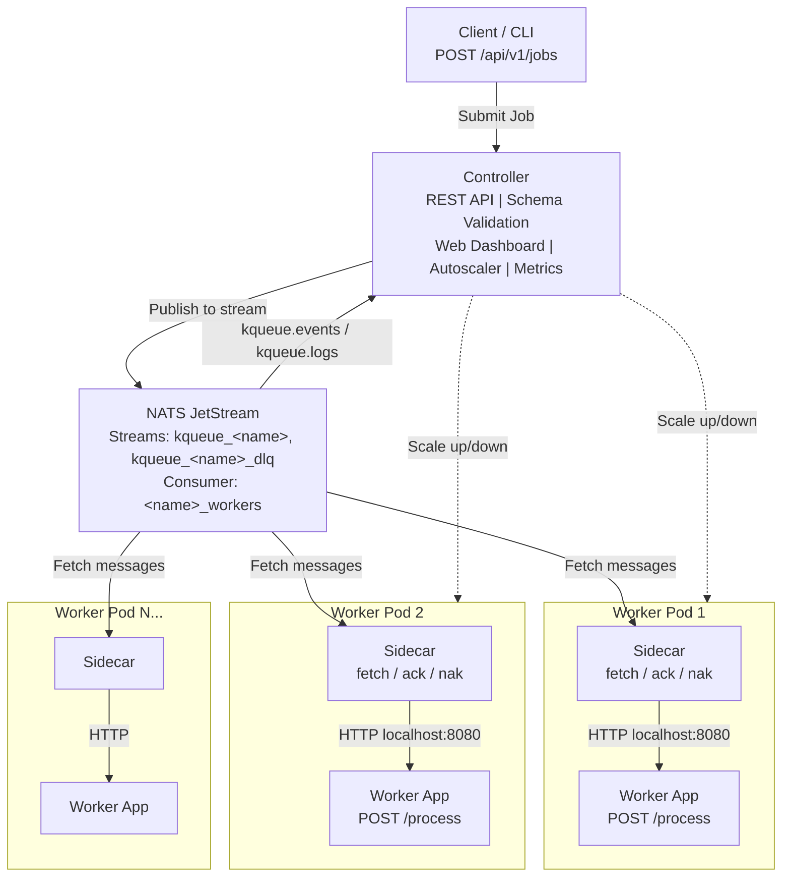
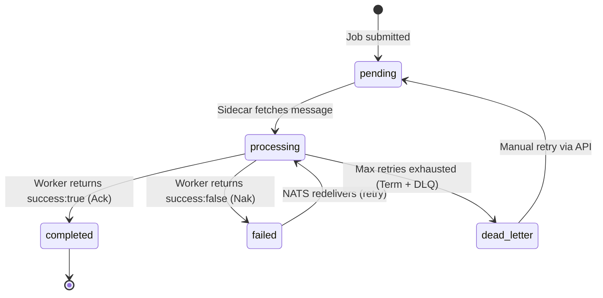
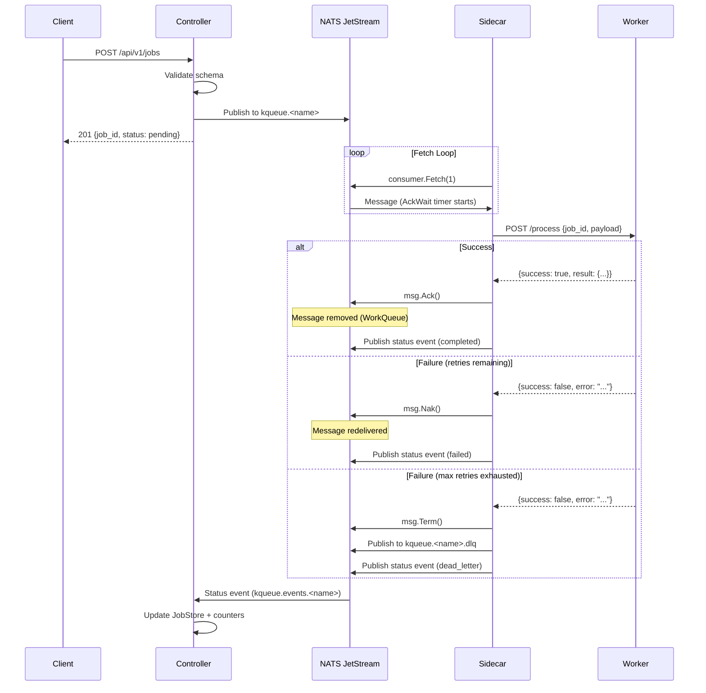
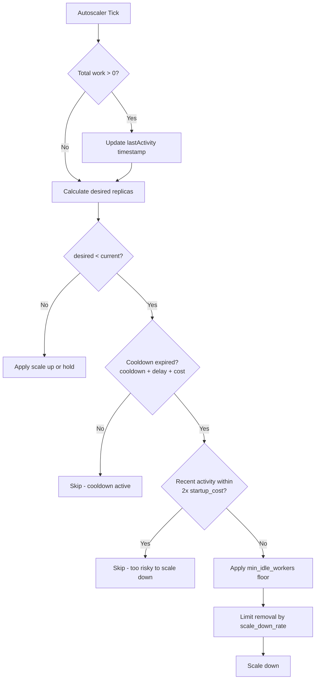
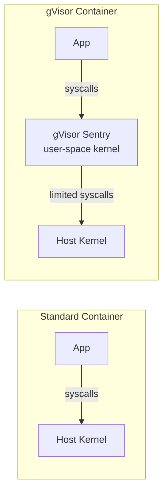
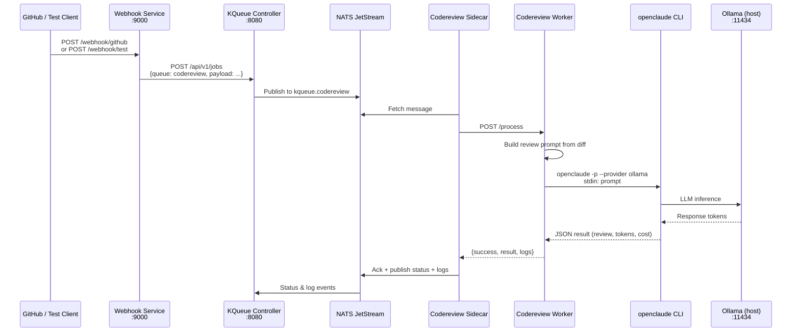

# KQueue Architecture & Developer Guide

## 1. System Overview

KQueue is a scalable job queue framework for Kubernetes. It solves the problem of
distributing work across a fleet of worker containers with automatic scaling,
retries, dead-letter handling, and observability -- without requiring workers to
know anything about queues, messaging protocols, or Kubernetes.

**Problems KQueue solves:**

- Decouples job producers from consumers via a durable message queue
- Automatically scales worker pools up and down based on queue depth
- Handles retries and dead-letter routing without worker awareness
- Provides a unified REST API for job submission, status tracking, and DLQ management
- Adds schema validation, Prometheus metrics, and a web dashboard out of the box

### Architecture Diagram



### Key Design Decisions

| Decision | Rationale |
|----------|-----------|
| Sidecar pattern | Workers stay simple HTTP servers. Queue protocol, retries, metrics, and status reporting are handled by the sidecar. Workers can be written in any language. |
| NATS JetStream | Provides durable, at-least-once delivery with built-in consumer groups, replay, and file-backed persistence. Lightweight single binary, no ZooKeeper/etcd dependency. |
| In-memory stores | The controller keeps job state, counters, and logs in memory. This keeps the system simple and dependency-free. Trade-off: state is lost on controller restart. |
| WorkQueue retention | Messages are removed from the stream once acknowledged. This prevents double-processing and keeps streams lean. |
| Schema validation at submit time | Invalid payloads are rejected before they enter the queue, preventing wasted processing and DLQ noise. |

### Component Responsibilities

| Component | Package | Role |
|-----------|---------|------|
| Controller | `cmd/controller/` | REST API, queue setup, autoscaler, status tracking, UI |
| Sidecar | `cmd/sidecar/` | Message fetch loop, worker HTTP calls, retry/DLQ logic, status events |
| Queue Manager | `pkg/queue/` | NATS connection, stream/consumer creation, publish/stats |
| Autoscaler | `pkg/scaler/` | Periodic evaluation, scaling strategies, cost-aware scaling |
| K8s Deployer | `pkg/k8s/` | Create/update Deployments, scale replicas, sidecar injection |
| Validator | `pkg/validate/` | Per-queue JSON Schema validation |
| Metrics | `pkg/metrics/` | Prometheus counter/gauge/histogram definitions |
| Config | `internal/config/` | YAML config loading with defaults |

---

## 2. Architecture Deep Dive

### 2.1 Controller

The controller (`cmd/controller/main.go`) is the central service. It runs in one
of two modes:

- **Kubernetes mode** (default): creates Deployments for workers, scales via the
  Kubernetes API.
- **Local mode** (`--local` flag): uses a no-op scaler, intended for
  docker-compose development.

#### REST API Reference

| Method | Path | Request Body | Success Response | Status | Description |
|--------|------|-------------|------------------|--------|-------------|
| `POST` | `/api/v1/jobs` | `SubmitRequest` | `SubmitResponse` | `201` | Submit a job |
| `GET` | `/api/v1/jobs/{id}` | -- | `Job` | `200` | Get job by ID |
| `GET` | `/api/v1/jobs/{id}/logs` | -- | `[]LogEntry` | `200` | Get per-job log entries |
| `GET` | `/api/v1/queues` | -- | `[]QueueStats` | `200` | List all queue stats |
| `GET` | `/api/v1/queues/{name}` | -- | `QueueStats` | `200` | Get single queue stats |
| `GET` | `/api/v1/queues/{name}/schema` | -- | `{queue, schema}` | `200` | Get payload schema |
| `GET` | `/api/v1/queues/{name}/jobs` | `?status=<filter>` | `[]Job` (max 100) | `200` | List jobs for a queue |
| `GET` | `/api/v1/queues/{name}/dlq` | -- | `[]Job` | `200` | List dead-letter jobs |
| `POST` | `/api/v1/queues/{name}/dlq/{jobId}/retry` | -- | `SubmitResponse` | `200` | Retry a DLQ job |
| `GET` | `/health` | -- | `{"status":"ok"}` | `200` | Health check |
| `GET` | `/metrics` | -- | Prometheus text | `200` | Prometheus metrics |

**Error responses:**

| Status | Condition |
|--------|-----------|
| `400` | Missing queue, unknown queue, invalid JSON body |
| `404` | Job not found, queue not found, DLQ job not found |
| `422` | Payload fails schema validation (returns `{error, queue, details}`) |
| `500` | NATS publish failure, internal error |

#### Job Lifecycle State Machine



#### In-Memory Stores

The controller maintains four in-memory stores:

- **JobStore**: maps job ID to `*api.Job`. Updated on submit and on status events.
- **DLQStore**: maps queue name to a list of dead-letter `*api.Job` entries.
  Populated from status events, supports removal on retry.
- **QueueCounters**: per-queue counters for completed, failed, and dead_letter
  counts. NATS WorkQueue retention removes acknowledged messages, so these
  counters track lifetime totals.
- **LogStore**: maps job ID to `[]LogEntry`. Populated from NATS log events
  published by sidecars.

#### NATS Event Subscription

On startup the controller subscribes to two NATS subjects per queue:

- `kqueue.events.<name>` -- status events (`statusEvent`). Updates job status,
  increments counters, records DLQ entries, updates Prometheus metrics.
- `kqueue.logs.<name>` -- log events (`logEvent`). Appends to the per-job log
  store for retrieval via `GET /api/v1/jobs/{id}/logs`.

These are plain NATS pub/sub (not JetStream), so events are fire-and-forget.
If the controller is down when an event fires, that update is lost. The source
of truth for delivery state is NATS JetStream; the controller stores are a
best-effort view.

#### Static UI

When `server.ui_enabled` is true, the controller serves embedded static files
from `ui/static/` on `/*` (catch-all after API routes). The dashboard polls
`/api/v1/queues` and `/api/v1/queues/{name}/jobs` to display queue status.

---

### 2.2 NATS JetStream

#### Why JetStream

- **Persistence**: FileStorage survives NATS restarts.
- **Exactly-once publish**: `WithMsgID(job.ID)` enables deduplication.
- **Consumer groups**: multiple sidecar instances share a durable consumer,
  distributing work automatically.
- **Built-in redelivery**: AckWait + MaxDeliver handle retries without
  application-level retry loops.

#### Stream Configuration

Main stream (per queue):

```
Name:      kqueue_<name>          (e.g., kqueue_echo)
Subjects:  [kqueue.<name>]        (e.g., kqueue.echo)
Retention: WorkQueuePolicy        -- messages removed once acknowledged
Storage:   FileStorage            -- survives NATS restart
MaxAge:    24 hours               -- unprocessed messages expire after 1 day
Replicas:  1                      -- single node (increase for HA)
```

DLQ stream (per queue):

```
Name:      kqueue_<name>_dlq      (e.g., kqueue_echo_dlq)
Subjects:  [kqueue.<name>.dlq]    (e.g., kqueue.echo.dlq)
Retention: LimitsPolicy           -- messages retained until MaxAge
Storage:   FileStorage
MaxAge:    7 days                  -- dead-letter messages kept for inspection
Replicas:  1
```

#### Consumer Configuration

```
Name:          <name>_workers      (e.g., echo_workers)
Durable:       <name>_workers      -- survives consumer restarts
AckPolicy:     AckExplicit         -- sidecar must Ack, Nak, or Term each message
AckWait:       processing_timeout  -- if no ack within this window, redeliver
MaxDeliver:    max_retries + 1     -- total delivery attempts (1 initial + N retries)
FilterSubject: kqueue.<name>       -- only receive messages for this queue
```

#### Message Flow



**Summary of ack behaviors:**

1. **Ack**: message removed from stream (WorkQueue retention).
2. **Nak**: message immediately available for redelivery.
3. **Term**: message permanently removed (used for garbage or final DLQ).

#### What Happens If NATS Restarts

FileStorage persists streams and consumers to disk. After a NATS restart:

- All unacknowledged messages are still in the stream.
- Durable consumers resume from their last acknowledged position.
- Messages whose AckWait expired during the outage are immediately available
  for redelivery.
- The controller and sidecars reconnect automatically (configured with
  `RetryOnFailedConnect(true)` and `MaxReconnects(-1)`).

---

### 2.3 Worker Sidecar

The sidecar (`cmd/sidecar/main.go`) is the bridge between NATS and the worker
container. It runs as a separate container in the same pod (Kubernetes) or as a
separate service (docker-compose).

#### Purpose

The sidecar decouples queue protocol from worker logic. Workers are plain HTTP
servers that know nothing about NATS, retries, or dead-letter queues.

#### Message Fetch Loop

```
for {
    msgs = consumer.Fetch(1, FetchMaxWait(5s))
    for msg in msgs.Messages() {
        processMessage(msg)
    }
}
```

- Fetches one message at a time with a 5-second timeout.
- On timeout (no messages), loops back and fetches again.
- On context cancellation (shutdown signal), exits the loop.

#### Worker HTTP Call

The sidecar sends an HTTP POST to the worker URL (default
`http://localhost:8080/process`) with:

```json
{
  "job_id": "abc-123",
  "payload": { ... }
}
```

The HTTP client has a 5-minute timeout. The worker must respond with:

```json
{
  "success": true|false,
  "result": { ... },
  "error": "..."
}
```

In docker-compose, the worker URL points to the worker service name (e.g.,
`http://echo-worker:8080/process`). In Kubernetes, the sidecar and worker share
a pod, so the URL is `http://localhost:8080/process`.

#### Retry Mechanics

The sidecar uses `msg.Metadata().NumDelivered` to determine the current delivery
attempt. This is managed by NATS -- not stored in the job payload -- so it
survives redeliveries and sidecar restarts.

**On each message:**

1. Parse the job JSON. If unparseable, call `msg.Term()` (permanent removal,
   no retry -- garbage messages should not clog the queue).

2. Read `meta.NumDelivered` (1-based). This is the delivery attempt number.

3. Publish a `processing` status event.

4. POST to the worker.

5. **If the worker succeeds** (HTTP 2xx and `success:true`):
   - Call `msg.Ack()` -- message removed from stream.
   - Publish `completed` status event with result.
   - Record `jobs_completed` and `job_processing_duration` metrics.

6. **If the worker fails and NumDelivered < MaxRetries+1** (not the final attempt):
   - Call `msg.Nak()` -- NATS will redeliver the message.
   - Publish `failed` status event.
   - Record `jobs_failed` metric.

7. **If the worker fails and NumDelivered >= MaxRetries+1** (final attempt):
   - Call `msg.Term()` -- permanent removal from the main stream.
   - Publish the job to the DLQ stream (`kqueue.<name>.dlq`).
   - Publish `dead_letter` status event.
   - Record `jobs_dead_lettered` metric.

#### Status Event Publishing

The sidecar publishes JSON events to `kqueue.events.<queue>`:

```json
{
  "job_id": "abc-123",
  "queue": "echo",
  "status": "completed|failed|processing|dead_letter",
  "result": { ... },
  "error": "..."
}
```

#### Log Event Publishing

The sidecar publishes structured log events to `kqueue.logs.<queue>`:

```json
{
  "job_id": "abc-123",
  "queue": "echo",
  "timestamp": "2026-04-23T12:00:00.000Z",
  "level": "info|warn|error",
  "message": "Job picked up by worker abc (attempt 1/4)"
}
```

Automatic log messages include:
- Job pickup with hostname and attempt number
- Worker response status, success flag, and duration
- Completion confirmation
- Failure with error details
- DLQ routing with exhaustion details

#### Prometheus Metrics

The sidecar records:
- `kqueue_job_processing_duration_seconds{queue}` -- histogram of worker call
  duration (recorded on every attempt, success or failure).
- `kqueue_jobs_completed_total{queue}` -- incremented on success.
- `kqueue_jobs_failed_total{queue}` -- incremented on retriable failure.
- `kqueue_jobs_dead_lettered_total{queue}` -- incremented on DLQ routing.

---

### 2.4 Autoscaler

The autoscaler (`pkg/scaler/autoscaler.go`) runs inside the controller on a
10-second tick. On each tick it evaluates every registered queue.

#### Evaluation Loop

1. Fetch queue stats from NATS: `pending` (NumPending) and `processing`
   (NumAckPending).
2. Get current replicas from Kubernetes (or noop scaler in local mode).
3. Track activity: record the last time `pending + processing > 0`.
4. Calculate desired replicas using the configured strategy.
5. Clamp to `[min, max]`.
6. Apply cost-aware adjustments (min idle workers, scale-down rate).
7. Check cooldown. If in cooldown, skip.
8. Check cost-aware scale-down guards. If recent activity, skip scale-down.
9. Issue scale command.

#### Scaling Strategies

**Threshold** (`type: threshold`)

Scale up when total work exceeds a threshold, down when it drops below another.

```
total_work = pending + processing

if total_work > scale_up_threshold:
    desired = current + scale_up_step
elif total_work < scale_down_threshold and current > min:
    desired = current - scale_down_step
else:
    desired = current
```

Example: `scale_up_threshold=10, scale_up_step=2, scale_down_threshold=2, scale_down_step=1`

| Pending | Processing | Total | Current | Desired |
|---------|-----------|-------|---------|---------|
| 12 | 0 | 12 | 2 | 4 |
| 3 | 2 | 5 | 4 | 4 |
| 1 | 0 | 1 | 4 | 3 |
| 0 | 0 | 0 | 3 | 2 |

**Rate** (`type: rate`)

Scale based on the work-per-worker ratio.

```
work_per_worker = total_work / current

if work_per_worker > scale_up_threshold:
    desired = current + scale_up_step
elif work_per_worker < scale_down_threshold and current > min:
    desired = current - scale_down_step
else:
    desired = current
```

Example: `scale_up_threshold=10, scale_down_threshold=2`

| Total Work | Current | Work/Worker | Action |
|-----------|---------|-------------|--------|
| 30 | 3 | 10.0 | At threshold, no change |
| 40 | 3 | 13.3 | Scale up |
| 4 | 3 | 1.3 | Scale down |

**Target Per Worker** (`type: target_per_worker`)

Directly compute the desired replica count.

```
if total_work == 0:
    desired = min
else:
    desired = ceil(total_work / target_per_worker)
```

Example: `target_per_worker=5`

| Total Work | Desired | After Clamp (min=1, max=10) |
|-----------|---------|----------------------------|
| 0 | 1 (min) | 1 |
| 3 | 1 | 1 |
| 23 | 5 | 5 |
| 100 | 20 | 10 |

#### Cooldown Mechanism

After any scale event, the autoscaler will not scale the same queue again until
`cooldown_seconds` have elapsed. This prevents flapping.

For cost-aware scale-down, the effective cooldown is:

```
effective_cooldown = cooldown_seconds + scale_down_delay_seconds + startup_cost_seconds
```

#### Cost-Aware Scaling

Cost-aware scaling is designed for workers with expensive initialization -- ML
model loading, GPU warmup, large dependency setup, etc. It adds four fields to
`scale_strategy`:

| Field | Type | Default | Description |
|-------|------|---------|-------------|
| `startup_cost_seconds` | int | 0 | Estimated time for a new pod to become useful. When > 0, enables cost-aware logic. |
| `scale_down_delay_seconds` | int | 0 | Extra delay added to cooldown before allowing scale-down. |
| `min_idle_workers` | int | 0 | Keep this many idle workers warm above `replicas.min` to handle burst traffic. Clamped to `replicas.max`. |
| `scale_down_rate` | float | 0.5 | Maximum fraction of workers to remove per scale-down cycle. Prevents mass termination. |

**Activity tracking**: the autoscaler records the last time any work was seen
(pending + processing > 0). If the last activity was within
`2 * startup_cost_seconds`, scale-down is skipped entirely. This prevents
scaling down right after a burst when new work may arrive soon.

**Scale-down decision flow:**



**When to use cost-aware scaling:**
- ML model workers that take 30-120 seconds to load models
- GPU workers where pod scheduling is slow
- Workers with expensive initialization (large downloads, cache warming)
- Any pod where scaling down and back up is significantly more expensive than
  keeping idle workers running

Example configuration for an ML worker:

```yaml
scale_strategy:
  type: target_per_worker
  target_per_worker: 3
  cooldown_seconds: 60
  startup_cost_seconds: 90      # Model loading takes ~90 seconds
  scale_down_delay_seconds: 120 # Wait 2 extra minutes before scaling down
  min_idle_workers: 2           # Always keep 2 warm workers
  scale_down_rate: 0.25         # Remove at most 25% of workers per cycle
```

---

### 2.5 Schema Validation

The validator (`pkg/validate/schema.go`) enforces per-queue JSON Schema
validation on job payloads at submit time. This rejects invalid payloads before
they enter the queue.

#### How It Works

1. On startup, the controller compiles schemas from the `payload_schema` field
   of each queue config.
2. When a job is submitted, `validator.Validate(queue, payload)` is called.
3. If validation fails, the API returns HTTP 422 with detailed errors.
4. If the queue has no schema, all payloads are accepted.

#### Supported Validations

| Feature | Description |
|---------|-------------|
| `type: object` | Top-level type must be "object" |
| `required: [...]` | List of fields that must be present |
| `properties.<name>.type` | Type checking: `string`, `number`, `boolean`, `array`, `object` |
| `properties.<name>.enum` | Value must be one of the listed values |

#### Error Response (HTTP 422)

```json
{
  "error": "payload validation failed",
  "queue": "echo",
  "details": [
    "missing required field \"action\"",
    "field \"action\" must be one of [echo uppercase count], got \"invalid\""
  ]
}
```

#### Schema Introspection

```
GET /api/v1/queues/{name}/schema
```

Returns the raw schema if configured, or a message indicating no schema:

```json
{
  "queue": "echo",
  "schema": {
    "type": "object",
    "required": ["action"],
    "properties": {
      "action": { "type": "string", "enum": ["echo", "uppercase"] }
    }
  }
}
```

#### Configuration Example

```yaml
queues:
  - name: echo
    payload_schema:
      type: object
      required:
        - action
      properties:
        action:
          type: string
          enum: ["echo", "uppercase", "count", "sort", "reverse", "hash", "delay"]
        text:
          type: string
        items:
          type: array
        ms:
          type: number
```

---

### 2.6 Kubernetes Deployer

The deployer (`pkg/k8s/deployer.go`) creates and manages worker Deployments in
Kubernetes. It implements the `WorkerScaler` interface so the autoscaler can
scale worker pools.

#### How Worker Deployments Are Created

On startup (in non-local mode), the controller calls `EnsureDeployment` for each
queue. This creates a Deployment named `kqueue-worker-<name>` with two
containers:

1. **worker**: the user-provided image, with port 8080 exposed and a readiness
   probe on `GET /health`.
2. **sidecar**: the KQueue sidecar image, configured with environment variables
   for NATS URL, queue name, subject, worker URL, and max retries. Fixed
   resources: 50m/100m CPU, 64Mi/128Mi memory.

#### Sidecar Injection

The sidecar container is automatically added to every worker Deployment. The
worker URL is set to `http://localhost:8080/process` because both containers
share the same pod network namespace.

#### Resource Configuration

Worker container resources are configured per-queue in the config YAML:

```yaml
resources:
  cpu_request: "100m"      # Minimum CPU
  cpu_limit: "500m"        # Maximum CPU
  memory_request: "128Mi"  # Minimum memory
  memory_limit: "512Mi"    # Maximum memory
  gpu_limit: "1"           # nvidia.com/gpu (optional)
```

#### Sandboxed Execution with gVisor

KQueue supports running worker pods inside [gVisor](https://gvisor.dev/) sandboxes
via Kubernetes RuntimeClasses. This is critical for workloads that execute
untrusted code (like the `sandbox-worker` example, which runs arbitrary shell
commands from job payloads).

**What gVisor does:**

gVisor (runsc) is an application kernel that intercepts all container syscalls
and re-implements them in a sandboxed user-space process. Unlike standard
containers (which share the host kernel), gVisor provides:

- **Syscall filtering**: the container never makes direct syscalls to the host kernel
- **Filesystem isolation**: file operations go through gVisor's in-memory VFS
- **Network isolation**: network stack is re-implemented in user space
- **Exploit mitigation**: kernel vulnerabilities don't affect sandboxed containers



**When to use gVisor:**

- Workers that execute user-supplied code or scripts
- Workers that process untrusted data in formats with a history of parser exploits (PDFs, images)
- Multi-tenant environments where worker pods handle different customers' data
- Any queue where a compromised worker must not affect the host or other pods

**Performance tradeoffs:**

- Syscall overhead: ~2-10x slower for syscall-heavy workloads
- Memory overhead: ~50-100MB per pod for the gVisor sentry process
- I/O performance: reduced for heavy filesystem operations
- Network: slightly higher latency due to user-space network stack
- Startup time: slightly longer (gVisor sentry initialization)

These costs are often acceptable because job queues are throughput-oriented
(scale out with more pods) rather than latency-sensitive.

**Requirements:**

1. gVisor (`runsc`) must be installed on cluster nodes. Installation methods:
   - GKE: enable the "gVisor sandbox" node pool option (easiest)
   - containerd: install runsc and add it as a runtime handler
   - Manual: see [gvisor.dev/docs/user_guide/install](https://gvisor.dev/docs/user_guide/install/)

2. A Kubernetes RuntimeClass must be created:

```yaml
# deploy/examples/gvisor-runtimeclass.yaml
apiVersion: node.k8s.io/v1
kind: RuntimeClass
metadata:
  name: gvisor
handler: runsc
```

3. Set `runtime_class` in the queue config:

```yaml
queues:
  - name: sandbox
    runtime_class: gvisor
    # Consider cost-aware scaling since gVisor adds startup overhead
    scale_strategy:
      startup_cost_seconds: 10
```

This sets `spec.runtimeClassName` on the worker pod spec. The Kubernetes
scheduler will only place these pods on nodes that have the `runsc` handler
installed.

**Local development (docker-compose):**

gVisor is not available in docker-compose. The `runtime_class` field is ignored
in local mode. The sandbox worker runs without gVisor isolation locally -- this
is fine for development, but the worker should only process untrusted input in a
gVisor-enabled Kubernetes cluster.

**Verifying gVisor is active:**

```bash
# Check the pod is using the gvisor runtime
kubectl -n kqueue get pod -l kqueue/queue=sandbox -o jsonpath='{.items[0].spec.runtimeClassName}'
# Should output: gvisor

# From inside the container, check the kernel
kubectl -n kqueue exec -it <pod-name> -c worker -- uname -r
# gVisor shows something like: 4.4.0 (gVisor sentry)

# Run dmesg - gVisor intercepts this
kubectl -n kqueue exec -it <pod-name> -c worker -- dmesg
# Should show gVisor-specific output, not host kernel messages
```

#### RBAC Requirements

The controller needs a ClusterRole with these permissions:

```yaml
rules:
  - apiGroups: ["apps"]
    resources: ["deployments"]
    verbs: ["create", "update", "get", "list", "watch", "delete"]
  - apiGroups: ["apps"]
    resources: ["deployments/scale"]
    verbs: ["get", "update"]
  - apiGroups: [""]
    resources: ["services"]
    verbs: ["create", "update", "get", "list", "watch", "delete"]
  - apiGroups: [""]
    resources: ["pods"]
    verbs: ["get", "list", "watch"]
```

The full RBAC setup is in `deploy/base/controller.yaml`.

---

## 3. Implementing a New Worker

### 3.1 The Worker Convention

Every KQueue worker MUST expose two HTTP endpoints on port 8080:

| Endpoint | Method | Purpose |
|----------|--------|---------|
| `/process` | POST | Receive and process a job |
| `/health` | GET | Return 200 when the worker is ready |

**Request format** (received by `/process`):

```json
{
  "job_id": "550e8400-e29b-41d4-a716-446655440000",
  "payload": <any valid JSON>
}
```

**Response format** (returned by `/process`):

```json
{
  "success": true,
  "result": <any valid JSON>,
  "error": ""
}
```

The worker knows nothing about NATS, queues, retries, or Kubernetes. The sidecar
handles all of that.

### 3.2 Handling the Payload

The `payload` field is arbitrary JSON (`json.RawMessage` in Go, any JSON value
in Python). There are two common patterns:

**Pattern 1: Multi-action worker (action field)**

Use an `action` field to dispatch to different handlers. The echo-worker uses
this pattern:

```go
var payloadMap map[string]interface{}
json.Unmarshal(req.Payload, &payloadMap)

switch payloadMap["action"].(string) {
case "uppercase":
    text := payloadMap["text"].(string)
    result = strings.ToUpper(text)
case "count":
    text := payloadMap["text"].(string)
    result = len(strings.Fields(text))
case "reverse":
    // ...
}
```

Submit jobs with: `{"queue":"echo","payload":{"action":"uppercase","text":"hello"}}`

**Pattern 2: Typed payload for single-purpose workers**

Parse the entire payload as a typed struct. The nlp-worker uses this pattern:

```python
payload = data.get("payload", {})
text = payload.get("text", "")

word_count = len(text.split())
char_count = len(text)
# ...
```

Submit jobs with: `{"queue":"nlp","payload":{"text":"analyze this sentence"}}`

### 3.3 Logging and Observability

**Worker stdout/stderr**: captured by the container runtime. View with
`kubectl logs` or `docker compose logs`.

**Structured log events**: the sidecar publishes to `kqueue.logs.<queue>` on
NATS. The controller stores these and exposes them via
`GET /api/v1/jobs/{id}/logs`. Workers do not need to publish log events -- the
sidecar does it automatically.

**What gets logged automatically:**
- Job pickup (worker hostname, attempt number)
- Worker response (HTTP status, success flag, duration)
- Completion confirmation with duration
- Failure with error details and retry info
- DLQ routing with exhaustion message

**Prometheus metrics** (recorded by the sidecar):

| Metric | Type | Labels | Description |
|--------|------|--------|-------------|
| `kqueue_jobs_submitted_total` | Counter | queue | Jobs submitted (recorded by controller) |
| `kqueue_jobs_completed_total` | Counter | queue | Jobs completed successfully |
| `kqueue_jobs_failed_total` | Counter | queue | Job failures (each failed attempt) |
| `kqueue_jobs_dead_lettered_total` | Counter | queue | Jobs sent to DLQ |
| `kqueue_queue_depth` | Gauge | queue, status | Current queue depth |
| `kqueue_worker_replicas` | Gauge | queue | Current worker replica count |
| `kqueue_job_processing_duration_seconds` | Histogram | queue | Worker call duration (buckets: 0.1s to 51.2s) |
| `kqueue_scale_events_total` | Counter | queue, direction | Scale events (up/down) |

### 3.4 Error Handling and Retries

**Retriable failure**: return `{"success":false,"error":"reason"}` with HTTP 200.
The sidecar will Nak the message and NATS will redeliver it.

**Infrastructure failure**: return HTTP 5xx or let the request time out. The
sidecar treats any non-2xx response or decode failure as a failure and Naks.

**The sidecar handles all retry logic.** Workers do not need to know about
attempt counts, retry limits, or dead-letter queues.

- `max_retries` is configured per-queue in the config YAML, not per-worker.
- `processing_timeout` sets both the NATS AckWait and the HTTP client timeout.
  If the worker does not respond within this window, NATS considers the message
  unacknowledged and redelivers it.
- After `max_retries + 1` total deliveries, the message goes to the DLQ stream.

**What workers should NOT do:**
- Do not implement retry logic in the worker.
- Do not catch all errors and return `success:true` -- let failures propagate
  so the sidecar can retry.
- Do not store attempt counts -- the sidecar reads `NumDelivered` from NATS
  metadata.

### 3.5 Building the Docker Image

**Go worker (multi-stage build):**

```dockerfile
FROM golang:1.23-alpine AS builder
WORKDIR /app
COPY go.mod go.sum ./
RUN go mod download
COPY . .
RUN CGO_ENABLED=0 go build -ldflags="-s -w" -o worker .

FROM alpine:3.20
COPY --from=builder /app/worker /usr/local/bin/worker
EXPOSE 8080
HEALTHCHECK --interval=5s --timeout=3s CMD wget -qO- http://localhost:8080/health
ENTRYPOINT ["worker"]
```

**Python worker:**

```dockerfile
FROM python:3.12-slim
WORKDIR /app
COPY requirements.txt .
RUN pip install --no-cache-dir -r requirements.txt
COPY . .
EXPOSE 8080
HEALTHCHECK --interval=5s --timeout=3s \
  CMD python -c "import urllib.request; urllib.request.urlopen('http://localhost:8080/health')"
CMD ["python", "main.py"]
```

**Tips:**
- Always expose port 8080.
- Include a HEALTHCHECK for docker-compose health probes.
- Use alpine or slim base images to keep images small.
- For Go, use `CGO_ENABLED=0` for a static binary.

### 3.6 Configuring the Queue

Full `QueueConfig` reference with all fields:

| Field | Type | Default | Description |
|-------|------|---------|-------------|
| `name` | string | *required* | Queue identifier. Used in API paths, stream names, and deployment names. |
| `subject` | string | `kqueue.<name>` | NATS subject for this queue's messages. |
| `worker_image` | string | *required* | Docker image for the worker container. |
| `runtime_class` | string | `""` | Kubernetes RuntimeClass (e.g., `gvisor`). |
| `replicas.min` | int | `1` | Minimum worker replicas. |
| `replicas.max` | int | `10` | Maximum worker replicas. |
| `resources.cpu_request` | string | `"100m"` | CPU request for worker container. |
| `resources.cpu_limit` | string | `"500m"` | CPU limit for worker container. |
| `resources.memory_request` | string | `"128Mi"` | Memory request for worker container. |
| `resources.memory_limit` | string | `"512Mi"` | Memory limit for worker container. |
| `resources.gpu_limit` | string | `""` | GPU limit (`nvidia.com/gpu`). |
| `max_retries` | int | `3` | Maximum retry attempts before dead-lettering. Total deliveries = max_retries + 1. |
| `processing_timeout` | duration | `5m` | AckWait and HTTP client timeout. |
| `scale_strategy.type` | string | `"threshold"` | Scaling algorithm: `threshold`, `rate`, or `target_per_worker`. |
| `scale_strategy.scale_up_threshold` | int | `10` | Work threshold to trigger scale-up. |
| `scale_strategy.scale_down_threshold` | int | `2` | Work threshold to trigger scale-down. |
| `scale_strategy.target_per_worker` | int | `5` | Target jobs per worker (for `target_per_worker` strategy). |
| `scale_strategy.cooldown_seconds` | int | `30` | Minimum seconds between scale events. |
| `scale_strategy.scale_up_step` | int | `2` | Replicas to add per scale-up. |
| `scale_strategy.scale_down_step` | int | `1` | Replicas to remove per scale-down. |
| `scale_strategy.startup_cost_seconds` | int | `0` | Estimated pod startup time. Enables cost-aware scaling when > 0. |
| `scale_strategy.scale_down_delay_seconds` | int | `0` | Extra delay before scale-down. |
| `scale_strategy.min_idle_workers` | int | `0` | Idle workers to keep warm above min replicas. |
| `scale_strategy.scale_down_rate` | float | `0.5` | Max fraction of workers to remove per cycle (0.0-1.0). |
| `payload_schema` | object | `null` | JSON Schema for payload validation. |

**Example: fast lightweight worker (high throughput)**

```yaml
- name: echo
  worker_image: kqueue/echo-worker:latest
  replicas:
    min: 1
    max: 20
  resources:
    cpu_request: "50m"
    cpu_limit: "200m"
    memory_request: "32Mi"
    memory_limit: "128Mi"
  max_retries: 3
  processing_timeout: 30s
  scale_strategy:
    type: threshold
    scale_up_threshold: 10
    scale_down_threshold: 2
    cooldown_seconds: 15
    scale_up_step: 3
    scale_down_step: 2
```

**Example: ML/GPU worker (expensive startup)**

```yaml
- name: inference
  worker_image: my-org/ml-inference:v2
  replicas:
    min: 1
    max: 8
  resources:
    cpu_request: "1000m"
    cpu_limit: "4000m"
    memory_request: "2Gi"
    memory_limit: "8Gi"
    gpu_limit: "1"
  max_retries: 2
  processing_timeout: 10m
  scale_strategy:
    type: target_per_worker
    target_per_worker: 3
    cooldown_seconds: 60
    startup_cost_seconds: 120
    scale_down_delay_seconds: 300
    min_idle_workers: 1
    scale_down_rate: 0.25
```

**Example: sandboxed worker (gVisor, limited retries)**

```yaml
- name: sandbox
  worker_image: kqueue/sandbox-worker:latest
  runtime_class: gvisor
  replicas:
    min: 1
    max: 5
  resources:
    cpu_request: "100m"
    cpu_limit: "1000m"
    memory_request: "64Mi"
    memory_limit: "512Mi"
  max_retries: 1
  processing_timeout: 60s
  scale_strategy:
    type: threshold
    scale_up_threshold: 5
    scale_down_threshold: 1
    cooldown_seconds: 30
    startup_cost_seconds: 5
```

### 3.7 Adding Schema Validation

Define a `payload_schema` in the queue config. The schema uses a subset of
JSON Schema.

**Supported fields:**

| Field | Description |
|-------|-------------|
| `type` | Must be `"object"` at the top level |
| `required` | Array of field names that must be present |
| `properties.<name>.type` | Expected JSON type: `string`, `number`, `boolean`, `array`, `object` |
| `properties.<name>.enum` | Array of allowed values |

**Example: strict schema for the echo worker**

```yaml
payload_schema:
  type: object
  required:
    - action
  properties:
    action:
      type: string
      enum: ["echo", "uppercase", "count", "sort", "reverse", "hash", "delay"]
    text:
      type: string
    items:
      type: array
    ms:
      type: number
```

**Example: minimal schema (just require a text field)**

```yaml
payload_schema:
  type: object
  required:
    - text
  properties:
    text:
      type: string
```

**Example: no schema (accept anything)**

Omit `payload_schema` entirely. All JSON payloads will be accepted.

---

## 4. Retry Mechanics Reference

### Concrete Example: echo queue with max_retries=3

MaxDeliver is set to `max_retries + 1 = 4`, meaning NATS will deliver the
message at most 4 times.

#### Happy Path (succeed on first try)

| Delivery # | NumDelivered | Worker Result | Sidecar Action | NATS State | Status Event |
|-----------|-------------|---------------|----------------|------------|-------------|
| 1 | 1 | `{success:true}` | `msg.Ack()` | Message removed | `completed` |

#### Retry Path (fail twice, succeed on third)

| Delivery # | NumDelivered | Worker Result | Sidecar Action | NATS State | Status Event |
|-----------|-------------|---------------|----------------|------------|-------------|
| 1 | 1 | `{success:false}` | `msg.Nak()` | Redelivery queued | `failed` |
| 2 | 2 | `{success:false}` | `msg.Nak()` | Redelivery queued | `failed` |
| 3 | 3 | `{success:true}` | `msg.Ack()` | Message removed | `completed` |

#### DLQ Path (fail all attempts)

| Delivery # | NumDelivered | Worker Result | Sidecar Action | NATS State | Status Event |
|-----------|-------------|---------------|----------------|------------|-------------|
| 1 | 1 | `{success:false}` | `msg.Nak()` | Redelivery queued | `failed` |
| 2 | 2 | `{success:false}` | `msg.Nak()` | Redelivery queued | `failed` |
| 3 | 3 | `{success:false}` | `msg.Nak()` | Redelivery queued | `failed` |
| 4 | 4 | `{success:false}` | `msg.Term()` + publish to DLQ | Message removed | `dead_letter` |

On delivery 4: `NumDelivered (4) >= MaxRetries+1 (4)`, so the sidecar terminates
the message and publishes to the DLQ stream.

#### Edge Cases

**Sidecar crashes mid-processing**: the message is not acknowledged. After
`processing_timeout` (AckWait), NATS redelivers it with an incremented
NumDelivered. No duplicate processing occurs as long as the worker is
idempotent.

**NATS restarts**: FileStorage ensures all unacknowledged messages survive. The
durable consumer resumes from its last position. Sidecars reconnect
automatically.

**Garbage message (unparseable JSON)**: the sidecar calls `msg.Term()` immediately
without retrying. The message is permanently removed.

---

## 5. Build, Test, and Run

### 5.1 Prerequisites

- **Go 1.26+** (for building from source)
- **Docker** and **Docker Compose** v2
- Optional: **kubectl**, **kind** or **minikube** (for Kubernetes deployment)
- Optional: **nats** CLI (for inspecting streams)

### 5.2 Local Development (docker-compose)

```bash
# Build all images
make docker-build

# Start all services (NATS, controller, workers, sidecars)
make docker-up

# Check that everything is running
make status
```

**Service ports:**

| Port | Service |
|------|---------|
| 8080 | Controller API + Web Dashboard |
| 4222 | NATS client connections |
| 8222 | NATS monitoring dashboard |

**Submitting test jobs:**

```bash
# Submit a single echo job
make submit-echo

# Submit a single NLP job
make submit-nlp

# Submit 20 echo jobs (tests scaling)
make submit-batch

# Submit with curl directly
curl -s -X POST http://localhost:8080/api/v1/jobs \
  -H 'Content-Type: application/json' \
  -d '{"queue":"echo","payload":{"action":"uppercase","text":"hello world"}}'
```

**Web dashboard**: open http://localhost:8080 in a browser.

**Stop services:**

```bash
make docker-down    # Stop containers
make clean          # Stop + remove volumes + build artifacts
```

### 5.3 Running Tests

KQueue has three levels of tests. None require a Kubernetes cluster.

#### Unit Tests

```bash
make test
# or directly:
go test ./pkg/... ./internal/... -v -count=1
```

**What they cover:**
- `pkg/scaler/autoscaler_test.go` (26 tests) -- all three scaling strategies, min/max clamping, edge cases (zero work, very large queues), and cost-aware scaling (scale-down rate limiting, min idle workers, capping)
- Config loading, schema validation

**No external dependencies.** These tests use mock implementations of the
`WorkerScaler` interface and test the autoscaler logic in isolation.

#### Integration Tests

```bash
make test-integration
# or directly:
go test ./test/ -run Test -v -count=1
```

**What they cover** (9 tests):
- HTTP API handlers: submit job, get job, list queues, health endpoint
- Validation: missing queue field, unknown queue, invalid JSON body
- Job round-trip: submit then retrieve by ID
- Metadata persistence

**No NATS required.** These tests create a chi router with the same handler
logic as the controller and use `httptest.NewRecorder`. They exercise the API
contract without any queue infrastructure.

#### End-to-End Tests

```bash
# First, start the stack:
make docker-up

# Then run e2e tests:
make test-e2e
# or directly:
go test ./test/ -tags=e2e -v -count=1
```

**What they cover** (5 tests):
- Health check against the running service
- Submit a job and poll until completion
- Submit multiple concurrent jobs and verify all complete
- List queues returns expected queue names
- Non-existent job returns 404

**Requires docker-compose running.** The test has a `TestMain` that checks if
the service is reachable at `KQUEUE_BASE_URL` (default `http://localhost:8080`)
and skips gracefully if not.

#### Running a Single Test

```bash
# Run a specific test by name
go test ./pkg/scaler/ -run TestCostAware_ScaleDownRateLimit -v

# Run all tests matching a pattern
go test ./pkg/scaler/ -run TestCostAware -v

# Run with race detector
go test -race ./pkg/... ./internal/...
```

#### If Tests Fail

- **Unit tests**: check if you've modified `ScaleStrategy` or `QueueConfig`
  types without updating the test fixtures.
- **Integration tests**: check if API handler signatures or response formats
  have changed.
- **E2E tests**: ensure docker-compose is running (`make docker-up`), then
  check `docker compose ps` and `docker compose logs controller`.

### 5.4 Kubernetes Deployment

KQueue provides two deployment options:

#### Option A: Minimal Deployment (bring your own queues)

Deploys only the core infrastructure (NATS + controller) with an empty queue
config. You add your own queues and worker images.

```bash
# 1. Build and push the controller image
docker build -t my-registry/kqueue-controller:latest .
docker push my-registry/kqueue-controller:latest

# 2. Build and push the sidecar image
docker build -f Dockerfile.sidecar -t my-registry/kqueue-sidecar:latest .
docker push my-registry/kqueue-sidecar:latest

# 3. Deploy the core (NATS + controller with empty config)
kubectl apply -k deploy/minimal/
```

This creates:
- `kqueue` namespace
- NATS StatefulSet with JetStream enabled and 1Gi PersistentVolume
- Controller Deployment with empty queue config
- ServiceAccount, ClusterRole, ClusterRoleBinding (RBAC)

Then edit the ConfigMap to add your queues:

```bash
kubectl -n kqueue edit configmap kqueue-config
```

Add your queue definitions under the `queues:` key (see [Section 7](#7-configuration-reference)
for all options). After editing, restart the controller:

```bash
kubectl -n kqueue rollout restart deployment kqueue-controller
```

The controller will automatically create worker Deployments (with the sidecar
injected) for each queue.

**What you need to provide:**
- Worker container images pushed to a registry accessible from the cluster
- Queue config in the ConfigMap
- The sidecar image (`KQUEUE_SIDECAR_IMAGE` env var, defaults to `kqueue-sidecar:latest`)

#### Option B: Full Deployment (with examples)

Deploys NATS + controller pre-configured with the echo and nlp example queues.
Good for trying out KQueue.

```bash
# 1. Create a kind cluster
kind create cluster --name kqueue

# 2. Build all images
make docker-build

# 3. Load images into kind
kind load docker-image kqueue-controller:latest --name kqueue
kind load docker-image kqueue-sidecar:latest --name kqueue
kind load docker-image kqueue/echo-worker:latest --name kqueue
kind load docker-image kqueue/nlp-worker:latest --name kqueue

# 4. Deploy everything
kubectl apply -k deploy/base/

# 5. Verify
kubectl -n kqueue get pods
kubectl -n kqueue logs deployment/kqueue-controller

# 6. Access the API
kubectl -n kqueue port-forward svc/kqueue-controller 8080:8080
```

#### Optional: gVisor RuntimeClass for sandbox workers

```bash
kubectl apply -f deploy/examples/gvisor-runtimeclass.yaml
```

Requires gVisor (runsc) installed on cluster nodes. See
[Sandboxed Execution with gVisor](#sandboxed-execution-with-gvisor) for
full details and verification steps.

#### Deployment Directory Layout

```
deploy/
  minimal/           # Core only: NATS + controller, empty queue config
    kustomization.yaml
    controller.yaml
  base/              # Full: NATS + controller with echo/nlp example queues
    kustomization.yaml
    namespace.yaml
    nats.yaml
    controller.yaml
  examples/          # Extra manifests
    config.yaml              # Standalone example config file
    gvisor-runtimeclass.yaml # RuntimeClass for gVisor
```

---

## 6. Debugging Guide

### 6.1 Common Issues

| Symptom | Likely Cause | Fix |
|---------|-------------|-----|
| "stream not found" on sidecar startup | Controller has not created streams yet | Sidecar exits; docker-compose `depends_on` handles ordering. Restart sidecar if needed: `docker compose restart echo-sidecar` |
| Jobs stuck in "pending" | Sidecar not running or not connected to NATS | Check `docker compose logs echo-sidecar` for connection errors |
| Jobs stuck in "processing" | Worker is slow, crashed, or unresponsive | Will timeout after AckWait (processing_timeout) and redeliver. Check worker logs. |
| Jobs going to DLQ immediately | `max_retries: 0` means only 1 delivery attempt | Increase `max_retries` in config |
| Jobs going to DLQ after retries | Worker consistently failing | Check `docker compose logs echo-worker` for errors. Check `GET /api/v1/jobs/{id}/logs` for sidecar-level details. |
| Stats showing 0 completed | Controller not receiving NATS events | Check controller NATS connection. Events use plain pub/sub, not JetStream. |
| Schema validation errors on submit | Payload does not match `payload_schema` | Check `GET /api/v1/queues/{name}/schema` for the expected schema. |

### 6.2 Inspecting NATS

**NATS monitoring dashboard**: http://localhost:8222

**Using the NATS CLI:**

```bash
# List all streams
nats stream list

# Stream info (message count, consumer count, storage)
nats stream info kqueue_echo

# Consumer info (pending, ack pending, redeliveries)
nats consumer info kqueue_echo echo_workers

# View DLQ messages
nats stream view kqueue_echo_dlq

# Purge a stream (removes all messages -- use with caution)
nats stream purge kqueue_echo
```

**Using the HTTP monitoring API:**

```bash
# JetStream account info
curl -s http://localhost:8222/jsz | python3 -m json.tool

# Stream details with consumer info
curl -s http://localhost:8222/jsz?streams=true\&consumers=true | python3 -m json.tool
```

### 6.3 Inspecting Logs

```bash
# Controller: API requests, autoscaler decisions, NATS events
docker compose logs controller

# Sidecar: job pickup, worker calls, retries, DLQ routing
docker compose logs echo-sidecar

# Worker: application-level output
docker compose logs echo-worker

# Follow logs in real time
docker compose logs -f echo-sidecar echo-worker

# Per-job logs via API
curl -s http://localhost:8080/api/v1/jobs/{id}/logs | python3 -m json.tool
```

### 6.4 Prometheus Metrics

Metrics are available at http://localhost:8080/metrics (Prometheus text format).

**Key metrics to monitor:**

| Metric | What It Tells You |
|--------|-------------------|
| `kqueue_jobs_submitted_total` | Incoming job rate. Compare with completed to spot backlogs. |
| `kqueue_jobs_completed_total` | Completion rate. Should track submitted over time. |
| `kqueue_jobs_failed_total` | Failure rate. Includes each failed attempt, not just final failures. |
| `kqueue_jobs_dead_lettered_total` | Permanent failures. If this is increasing, investigate worker errors. |
| `kqueue_queue_depth{status="pending"}` | Queue backlog. If growing, workers may need scaling up. |
| `kqueue_worker_replicas` | Current worker count per queue. |
| `kqueue_job_processing_duration_seconds` | Processing latency. Use histogram quantiles for P50/P99. |
| `kqueue_scale_events_total{direction="up\|down"}` | Scaling activity. Frequent events may indicate flapping (increase cooldown). |

**Example Prometheus scrape config:**

```yaml
scrape_configs:
  - job_name: kqueue
    static_configs:
      - targets: ["controller:8080"]
```

---

## 7. Configuration Reference

Complete YAML configuration with all fields, types, defaults, and descriptions:

```yaml
server:
  port: 8080              # int    -- HTTP listen port (default: 8080)
  ui_enabled: true        # bool   -- serve web dashboard on /* (default: true)

nats:
  url: nats://nats:4222   # string -- NATS server URL (default: nats://nats:4222)
  stream_prefix: kqueue   # string -- prefix for JetStream stream names (default: kqueue)
                          #           streams are named <prefix>_<queue_name>

queues:
  - name: echo                      # string   -- queue identifier (required)
    subject: kqueue.echo            # string   -- NATS subject (default: kqueue.<name>)
    worker_image: img:tag           # string   -- Docker image for worker container (required)
    runtime_class: ""               # string   -- K8s RuntimeClass, e.g. "gvisor" (default: "")

    replicas:
      min: 1                        # int      -- minimum worker replicas (default: 1)
      max: 10                       # int      -- maximum worker replicas (default: 10)

    resources:
      cpu_request: "100m"           # string   -- worker CPU request (default: "100m")
      cpu_limit: "500m"             # string   -- worker CPU limit (default: "500m")
      memory_request: "128Mi"       # string   -- worker memory request (default: "128Mi")
      memory_limit: "512Mi"         # string   -- worker memory limit (default: "512Mi")
      gpu_limit: ""                 # string   -- nvidia.com/gpu limit (default: "", none)

    max_retries: 3                  # int      -- retry attempts before dead-lettering (default: 3)
                                    #             total deliveries = max_retries + 1
    processing_timeout: 5m          # duration -- AckWait and HTTP client timeout (default: 5m)
                                    #             supports Go duration strings: 30s, 2m, 10m

    scale_strategy:
      type: threshold               # string   -- "threshold" | "rate" | "target_per_worker"
                                    #             (default: "threshold")

      # Used by threshold and rate strategies:
      scale_up_threshold: 10        # int      -- work level to trigger scale-up (default: 10)
                                    #             threshold: absolute total work
                                    #             rate: work-per-worker ratio
      scale_down_threshold: 2       # int      -- work level to trigger scale-down (default: 2)
      scale_up_step: 2              # int      -- replicas to add per scale-up (default: 2)
      scale_down_step: 1            # int      -- replicas to remove per scale-down (default: 1)

      # Used by target_per_worker strategy:
      target_per_worker: 5          # int      -- desired jobs per worker (default: 5)
                                    #             desired = ceil(total_work / target_per_worker)

      # Common:
      cooldown_seconds: 30          # int      -- min seconds between scale events (default: 30)

      # Cost-aware scaling (optional, all default to 0/disabled):
      startup_cost_seconds: 0       # int      -- estimated pod startup time in seconds
                                    #             enables cost-aware logic when > 0
      scale_down_delay_seconds: 0   # int      -- extra delay before scale-down
                                    #             added to cooldown + startup_cost
      min_idle_workers: 0           # int      -- idle workers to keep above min replicas
                                    #             clamped to max replicas
      scale_down_rate: 0.5          # float    -- max fraction of workers to remove per cycle
                                    #             0.25 = remove at most 25% per cycle (default: 0.5)

    payload_schema:                 # object   -- optional JSON Schema for payload validation
      type: object                  #             omit entirely to accept any payload
      required:                     # []string -- fields that must be present
        - action
      properties:                   # object   -- per-field type and enum constraints
        action:
          type: string              # string   -- expected JSON type
          enum:                     # []any    -- allowed values
            - echo
            - uppercase
        text:
          type: string

metrics:
  enabled: true                     # bool     -- enable Prometheus metrics (default: true)
  port: 9090                        # int      -- dedicated metrics port (default: 9090)
```

---

## 8. Code Review System

KQueue includes a working LLM-powered code review pipeline as an example of a
real-world job. It receives GitHub webhook events, queues them as review jobs,
and uses a local Ollama instance to produce code review comments.

### 8.1 Architecture



### 8.2 Components

| Component | Location | Port | Description |
|-----------|----------|------|-------------|
| Webhook service | `cmd/webhook/` | 9000 | Receives GitHub webhooks, parses PR/push events, submits jobs to KQueue |
| Codereview worker | `examples/codereview-worker/` | 8080 | Builds a review prompt from the diff, calls openclaude, returns the review |
| openclaude | Installed in worker container | -- | CLI that connects to LLM providers (ollama, anthropic, openai, etc.) |
| Ollama | Host machine | 11434 | Local LLM inference backend (not containerized) |

### 8.3 Prerequisites

The codereview worker uses [openclaude](https://github.com/Gitlawb/openclaude)
as its LLM interface. openclaude is installed inside the worker container
automatically -- you don't need to install it on the host. But you do need a
model backend running.

**Ollama must be running on the host machine:**

```bash
# Install ollama (if not already installed)
# See https://ollama.com/download

# Pull a model
ollama pull llama3.2

# Verify it's running
curl http://localhost:11434/api/tags
```

The worker container connects to Ollama on the host via
`host.docker.internal:11434`. On **Rancher Desktop** this works automatically
via built-in DNS. On **Docker Desktop for Mac/Windows** it also works out of
the box. On **Linux** you may need to add
`extra_hosts: ["host.docker.internal:host-gateway"]` to the codereview-worker
service in docker-compose.yaml.

**If ollama is bound to localhost only** (the default), Docker containers on
some setups cannot reach it. Check with:

```bash
lsof -i :11434
```

If it shows `localhost:11434` and containers can't connect, restart with:

```bash
OLLAMA_HOST=0.0.0.0 ollama serve
```

**How openclaude is used:**

The worker shells out to openclaude in non-interactive mode:

```bash
openclaude -p --bare --provider ollama --model llama3.2 \
  --output-format json --no-session-persistence < prompt.txt
```

This returns structured JSON with the review text, token usage, cost, and
timing. The worker parses this and includes it in the job result and logs.

**Changing the provider or model:** set environment variables on the
codereview-worker service in docker-compose.yaml:

```yaml
environment:
  - OPENCLAUDE_PROVIDER=ollama      # or: anthropic, openai, gemini, github
  - OPENCLAUDE_MODEL=llama3.2       # any model available to the provider
  - OLLAMA_URL=http://host.docker.internal:11434
```

openclaude supports multiple providers. To use Anthropic's Claude API instead
of local Ollama, set `OPENCLAUDE_PROVIDER=anthropic` and ensure
`ANTHROPIC_API_KEY` is set.

**Model recommendations for code review:**

| Model | Size | Speed | Quality | Provider |
|-------|------|-------|---------|----------|
| `llama3.2` | 3B | Fast (~5s) | Good for basic reviews | ollama |
| `llama3.1` | 8B | Medium (~15s) | Better analysis | ollama |
| `qwen2.5-coder:7b` | 7B | Medium (~12s) | Optimized for code | ollama |
| `deepseek-coder:33b` | 33B | Slow (~60s) | Best code understanding | ollama |
| `claude-sonnet-4-6` | -- | Fast (~5s) | Excellent code review | anthropic |

### 8.4 Running a Code Review

**Start the services:**

```bash
make docker-build
make docker-up
```

**Submit a test review (no GitHub required):**

```bash
make submit-review
```

This sends a realistic PR payload to `POST localhost:9000/webhook/test` with
sample JWT authentication code and diffs. The webhook service forwards it to
KQueue, which queues it for the codereview worker.

**Submit a custom review:**

```bash
curl -X POST http://localhost:9000/webhook/test \
  -H 'Content-Type: application/json' \
  -d '{
    "repo_owner": "myorg",
    "repo_name": "myrepo",
    "pr_number": 123,
    "pr_title": "Refactor database layer",
    "pr_body": "Switches from raw SQL to sqlx for type safety.",
    "sender": "alice",
    "ref": "feature/sqlx",
    "files_changed": [
      {
        "filename": "db/queries.go",
        "status": "modified",
        "patch": "@@ -10,5 +10,5 @@\n-rows, _ := db.Query(\"SELECT * FROM users\")\n+var users []User\n+err := db.Select(&users, \"SELECT * FROM users\")"
      }
    ]
  }'
```

**Check the result:**

```bash
# Get the job_id from the submit response, then:
curl http://localhost:8080/api/v1/jobs/<job_id> | python3 -m json.tool

# View the per-job logs (includes the full LLM output):
curl http://localhost:8080/api/v1/jobs/<job_id>/logs | python3 -m json.tool
```

Or open the UI at http://localhost:8080, click the **codereview** queue card,
click a job row, and switch to the **Logs** tab to see the full review.

### 8.5 Connecting to Real GitHub Webhooks

To receive real PR/push events from GitHub:

1. Expose port 9000 to the internet (e.g., with ngrok):
   ```bash
   ngrok http 9000
   ```

2. In your GitHub repository: **Settings > Webhooks > Add webhook**
   - **Payload URL**: `https://<your-ngrok-url>/webhook/github`
   - **Content type**: `application/json`
   - **Secret**: set a secret and add `WEBHOOK_SECRET=<same-secret>` to the
     webhook service in docker-compose.yaml
   - **Events**: select "Pull requests" and "Pushes"

3. The webhook service validates the HMAC-SHA256 signature, parses the event,
   and queues a review job. Supported events:
   - `pull_request` (actions: `opened`, `synchronize`) -- queues a PR review
   - `push` -- queues a push review with the list of changed files
   - `ping` -- responds with `{"status":"pong"}`

**Note:** GitHub PR webhooks include metadata (title, body, file list) but
not the actual diffs. For full diff-based reviews, the worker would need to
clone the repo (the `cloneRepoPlaceholder` function is ready for this). The
test endpoint allows you to include `files_changed` with `patch` data directly.

### 8.6 Worker Logging

The codereview worker demonstrates the **worker log forwarding** pattern.
Workers can include a `logs` array in their response:

```json
{
  "success": true,
  "result": { ... },
  "logs": [
    {"level": "info", "message": "Starting review of 3 files"},
    {"level": "info", "message": "Calling Ollama (llama3.2)..."},
    {"level": "info", "message": "--- LLM Review Output ---"},
    {"level": "info", "message": "The changes look good overall..."},
    {"level": "info", "message": "--- End Review Output ---"}
  ]
}
```

The sidecar forwards these to the controller via NATS (`kqueue.logs.<queue>`),
where they appear in the per-job log store. Each entry is prefixed with
`[worker]` to distinguish worker logs from sidecar logs.

This pattern works for any worker -- not just the codereview worker. Any
worker that returns a `logs` array in its `ProcessResponse` will have those
logs forwarded and visible via the API and UI.

### 8.7 Future Improvements

The current implementation is a working prototype. Planned enhancements:

- **Git clone**: the `cloneRepoPlaceholder` function has commented code ready
  for `git clone --depth=1`. This would allow the worker to read full files,
  not just diffs.
- **GitHub API integration**: fetch PR diffs via the GitHub API instead of
  relying on webhook payload data.
- **Post review comments**: call the GitHub API to post review comments back
  on the PR.
- **Multi-file analysis**: analyze relationships between changed files for
  more holistic reviews.
- **Custom review rules**: configurable review criteria per repository.
